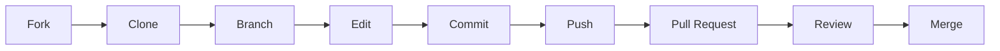

# 🚀 Codelab : Ma première contribution Open Source

> **Prérequis :** Aucun - parfait pour débuter !  
> **Objectif :** Réaliser sa première Pull Request sur GitHub

## 📚 Table des matières

- [Prérequis](#-prérequis)
- [Objectifs](#-objectifs)
- [Étape 1 : Créer votre compte GitHub](#étape-1--créer-votre-compte-github-5-min)
- [Étape 2 : Choisir un projet](#étape-2--choisir-un-projet-pour-contribuer-10-min)
- [Étape 3 : Explorer le projet](#étape-3--explorer-le-projet-5-min)
- [Étape 4 : Configurer Git](#étape-4--configurer-git-localement-5-min)
- [Étape 5 : Fork du projet](#étape-5--fork-du-projet-3-min)
- [Étape 6 : Cloner votre fork](#étape-6--cloner-votre-fork-localement-5-min)
- [Étape 7 : Créer une branche](#étape-7--créer-une-branche-pour-votre-contribution-3-min)
- [Étape 8 : Faire vos modifications](#étape-8--faire-vos-modifications-15-min)
- [Étape 9 : Commiter vos changements](#étape-9--commiter-vos-changements-5-min)
- [Étape 10 : Pousser vos changements](#étape-10--pousser-vos-changements-3-min)
- [Étape 11 : Créer une Pull Request](#étape-11--créer-une-pull-request-10-min)
- [Étape 12 : Après la Pull Request](#étape-12--après-la-pull-request-5-min)
- [Récapitulatif](#-récapitulatif-workflow)
- [FAQ](#-faq--problèmes-courants)

---

## 📋 Prérequis

Avant de commencer, assurez-vous d'avoir :

- [ ] Un ordinateur avec une connexion internet
- [ ] Git installé sur votre machine ([📥 Télécharger Git](https://git-scm.com/downloads))
- [ ] Un éditeur de code (VS Code recommandé)

> 💡 **Astuce** : Pour vérifier si Git est installé, tapez `git --version` dans votre terminal

## 🎯 Objectifs

À la fin de ce codelab, vous aurez :

- [x] ✅ Créé votre compte GitHub
- [x] ✅ Fait votre première contribution (fork + pull request)  
- [x] ✅ Compris le workflow de contribution

---

## Étape 1 : Créer votre compte GitHub (5 min)

### 1.1 Inscription

1. Rendez-vous sur **[github.com](https://github.com)**
2. Cliquez sur **"Sign up"**
3. Remplissez le formulaire :
   - **Username** : choisissez un nom professionnel (vous pourrez l'utiliser sur votre CV)
   - **Email** : utilisez votre email principal  
   - **Password** : créez un mot de passe sécurisé
4. Vérifiez votre compte via l'email reçu

---

## Étape 2 : Choisir un projet pour contribuer

Pour ce codelab, nous vous proposons plusieurs projets selon votre appétence :

### 🌱 Java
- **Projet** : [Codelab Java](https://github.com/zenika-open-source/how-to-contribute-opensource-java)
- **Types de contributions** : Corriger des fautes, améliorer la documentation

### 🌿 Pyhton
- **Projet** : [Codelab Python](https://github.com/zenika-open-source/how-to-contribute-opensource-python)
- **Types de contributions** : Ajouter des fonctions simples, corriger des bugs

### 🌳 Reactjs
- **Projet** : [Codelab ReactJs](https://github.com/zenika-open-source/how-to-contribute-opensource-react)  
- **Types de contributions** : Nouvelles fonctionnalités, refactoring

### 🏷️ Comment choisir une issue ?

1. Visitez le repository du projet choisi
2. Lisez le fichier `README.md` pour comprendre le projet
3. Consultez les **Issues** ouvertes (onglet "Issues")  
4. Cherchez les labels :
   - 🏷️ `good first issue` : parfait pour débuter
   - 🏷️ `help wanted` : les mainteneurs cherchent de l'aide
   - 🏷️ `documentation` : pour les améliorations de doc

---

## Étape 3 : Explorer le projet

### 3.1 Lecture du projet

Fichiers importants à consulter :

| Fichier | Description |
|---------|-------------|
| `README.md` | Description du projet, installation, usage |
| `CONTRIBUTING.md` | Règles de contribution ⚠️ **TRÈS IMPORTANT** |
| `Issues` | Problèmes à résoudre ou fonctionnalités demandées |
| `Pull Requests` | Contributions en cours de review |

### 3.2 Choisir une issue

1. Cliquez sur l'onglet **"Issues"**
2. Filtrez par label `good first issue`
3. Lisez plusieurs issues pour comprendre ce qui est demandé  
4. Choisissez une issue qui vous intéresse et semble à votre portée

**⚠️ Important** : Commentez sur l'issue pour indiquer votre intention, par exemple :

```markdown
Bonjour ! Je suis nouveau/nouvelle dans les contributions open source et 
j'aimerais travailler sur cette issue. Puis-je m'en charger ? Merci !
```

---

## Étape 4 : Configurer Git localement

Ouvrez votre terminal et configurez Git avec vos informations :

```bash
# Configuration de votre nom (utilisez votre vrai nom)
git config --global user.name "Votre Nom"

# Configuration de votre email (le même que GitHub) 
git config --global user.email "votre.email@example.com"

# Vérification de la configuration
git config --list
```

> 🔍 **Vérification** : Vous devriez voir vos informations s'afficher

---

## Étape 5 : Fork du projet

### 5.1 Créer le fork

1. Sur la page GitHub du projet, cliquez sur le bouton **"Fork"** (en haut à droite)
2. Sélectionnez votre compte personnel comme destination
3. Attendez que le fork se crée (quelques secondes)

### 5.2 Comprendre le fork

> 💡 **Qu'est-ce qu'un fork ?**  
> Un **fork** est votre copie personnelle du projet. Vous pouvez y faire tous les changements que vous voulez sans affecter le projet original.

```
Projet Original    →    Votre Fork
   (lecture)            (lecture + écriture)
```

---

## Étape 6 : Cloner votre fork localement

### 6.1 Obtenir l'URL de clone

1. Sur **votre fork** (pas le projet original !), cliquez sur **"Code"**
2. Copiez l'URL HTTPS


### 6.2 Cloner le repository

```bash
# Remplacez [VOTRE-USERNAME] et [NOM-DU-PROJET] par les vraies valeurs
git clone https://github.com/[VOTRE-USERNAME]/[NOM-DU-PROJET].git

# Exemple :
git clone https://github.com/johndoe/simple-calculator.git

# Entrez dans le dossier du projet  
cd [NOM-DU-PROJET]

# Vérifiez que tout fonctionne
ls -la
```

> ✅ **Checkpoint** : Vous devriez voir les fichiers du projet dans votre terminal

---

## Étape 7 : Créer une branche pour votre contribution

### 📏 Règle d'or 
> **Ne jamais travailler directement sur la branche `main` !**

```bash
# Créez et basculez sur une nouvelle branche
# Utilisez un nom descriptif de votre contribution
git checkout -b fix-typo-in-readme

# Autres exemples :
# git checkout -b add-multiplication-function  
# git checkout -b update-installation-docs

# Vérifiez que vous êtes sur la bonne branche
git branch
```

### 💡 Conseils pour nommer vos branches

| ✅ Bon | ❌ Éviter |
|--------|----------|
| `fix-login-bug` | `fix` |
| `add-new-feature` | `add new feature` |
| `update-readme` | `changes` |

**Pattern recommandé :** `verbe-description-courte`

---

## Étape 8 : Faire vos modifications

### 8.1 Ouvrir le projet dans votre éditeur

```bash
# Si vous utilisez VS Code
code .

# Ou ouvrez manuellement le dossier dans votre éditeur préféré
```

### 8.2 Effectuer les changements

Selon l'issue choisie, vous pourriez :

#### 📝 Pour une correction de documentation :
- Corriger les fautes de frappe
- Améliorer des phrases peu claires  
- Ajouter des exemples
- Mettre à jour des liens brisés

#### 💻 Pour une contribution de code :
- Ajouter une nouvelle fonction
- Corriger un bug
- Améliorer les tests
- Optimiser les performances

### 8.3 Tester vos changements


```bash
# Si le projet a des tests, lancez-les
npm test
# ou 
python -m pytest
# ou suivez les instructions du README

# Testez manuellement votre code si nécessaire
```

Le guide de contribution du projet contient les informations nécéssaires pour lancer les tests du projet.

> ⚠️ **Important** : Assurez-vous que vos changements ne cassent pas le projet existant !

---

## Étape 9 : Commiter vos changements

### 9.1 Vérifier les fichiers modifiés

```bash
# Voir quels fichiers ont été modifiés
git status

# Voir le détail des changements  
git diff
```

### 9.2 Ajouter les fichiers au commit

```bash
# Ajouter tous les fichiers modifiés
git add .

# Ou ajouter des fichiers spécifiques
git add README.md src/calculator.js
```

### 9.3 Créer le commit

```bash
# Commit avec un message clair et descriptif
git commit -m "Fix typo in installation instructions"

# Autres exemples :
# git commit -m "Add multiplication function to calculator"  
# git commit -m "Update broken links in contributing guide"
```

### 💡 Conseils pour les messages de commit

| ✅ Bon | ❌ Éviter |
|--------|----------|
| `Fix typo in README` | `fixed some stuff` |
| `Add login validation` | `changes` |
| `Remove deprecated function` | `updates` |

**Règles d'or :**
- Utilisez l'impératif : "Fix bug" plutôt que "Fixed bug"
- Soyez concis mais descriptifs (50 caractères max)
- Commencez par une majuscule
- Pas de point final

---

## Étape 10 : Pousser vos changement 

```bash
# Pousser votre branche vers votre fork
git push origin [nom-de-votre-branche]

# Exemple :
git push origin fix-typo-in-readme
```

> 📝 **Note** : Si c'est votre premier push sur cette branche, Git vous donnera une URL GitHub pour créer une pull request. **Copiez-la !**

---

## Étape 11 : Créer une Pull Request

### 11.1 Accéder à l'interface de PR

**3 méthodes au choix :**

1. **Méthode 1** : Cliquez sur l'URL fournie par Git dans le terminal
2. **Méthode 2** : Allez sur votre fork GitHub, vous verrez un bandeau jaune *"Compare & pull request"*
3. **Méthode 3** : Projet original > onglet "Pull requests" > "New pull request"

### 11.2 Remplir la Pull Request

#### Titre
Résumé concis de votre contribution
```
Fix typo in README installation section
```

#### Description
Expliquez votre contribution de manière détaillée

```markdown
## Description
Cette PR corrige une faute de frappe dans la section d'installation du README.

## Changements apportés
- Correction de "instalation" en "installation" ligne 23
- Amélioration de la clarté de la phrase d'introduction

## Tests  
- [x] J'ai relu les modifications
- [x] Les liens fonctionnent correctement
- [x] Le formatage Markdown est correct

Résout l'issue #42
```

### 11.3 Vérifier les détails

**Important** : Vérifiez ces paramètres avant de créer la PR

| Paramètre | Valeur correcte |
|-----------|----------------|
| **Base repository** | Le projet original (pas votre fork !) |
| **Base branch** | `main` ou `master` |
| **Head repository** | Votre fork |
| **Compare branch** | Votre branche de travail |

### 11.4 Créer la PR

Cliquez sur **"Create pull request"**

🎉 **Félicitations !** Vous venez de créer votre première pull request !

---

## Étape 12 : Après la Pull Request

### 🔄 Ce qui va se passer

1. **Review** : Les mainteneurs vont examiner votre code
2. **Feedback** : Ils peuvent demander des modifications  
3. **Tests automatiques** : Le code peut être testé automatiquement
4. **Merge** : Si tout va bien, votre PR sera fusionnée ! 🎊

### 🔧 Si des changements sont demandés

**Ne paniquez pas !** C'est normal et formateur.

1. Faites les modifications sur votre branche locale
2. Commitez les changements  
3. Poussez la branche (`git push origin [nom-branche]`)
4. **La PR sera automatiquement mise à jour** ✨

### 🤝 Bonnes pratiques communautaires

- ✅ **Répondez rapidement** aux commentaires
- ✅ **Remerciez** pour les reviews  
- ✅ **Ne prenez pas les critiques personnellement**
- ✅ **Soyez patient**, les mainteneurs sont souvent bénévoles
- ✅ **Posez des questions** si quelque chose n'est pas clair

---

## 🎯 Récapitulatif workflow

Voici le workflow que vous venez d'apprendre :



1. ✅ **Fork** → Créer votre copie du projet
2. ✅ **Clone** → Télécharger le code sur votre machine  
3. ✅ **Branch** → Créer une branche pour vos modifications
4. ✅ **Edit** → Faire vos changements
5. ✅ **Commit** → Sauvegarder vos changements
6. ✅ **Push** → Envoyer vos changements sur GitHub
7. ✅ **Pull Request** → Demander l'intégration de vos changements

---

## 🚀 Prochaines étapes

### Continuer à contribuer
- [ ] Trouvez d'autres issues sur le même projet
- [ ] Explorez de nouveaux projets sur GitHub
- [ ] Rejoignez des communautés (Discord, Slack)

### Améliorer vos compétences  
- [ ] Apprenez les bonnes pratiques de Git
- [ ] Lisez sur les conventions de code
- [ ] Participez à des événements comme [Hacktoberfest](https://hacktoberfest.digitalocean.com/)

### 📚 Ressources utiles

| Ressource | Description |
|-----------|-------------|
| [GitHub Docs](https://docs.github.com) | Documentation officielle |
| [Pro Git Book](https://git-scm.com/book) | Livre complet sur Git |
| [First Contributions](https://github.com/firstcontributions/first-contributions) | Projet pour s'exercer |

---

## ❓ FAQ / Problèmes courants

<details>
<summary><strong>🚫 "Je ne vois pas le bouton Fork"</strong></summary>

**Solution :** Vous devez être connecté à GitHub. Vérifiez que vous êtes bien logged in.
</details>

<details>  
<summary><strong>💻 "git command not found"</strong></summary>

**Solution :** Git n'est pas installé ou pas dans votre PATH. 
- Téléchargez Git depuis [git-scm.com](https://git-scm.com/downloads)
- Redémarrez votre terminal après installation
</details>

<details>
<summary><strong>🔒 "Permission denied" lors du push</strong></summary>

**Solution :** Vérifiez que vous poussez vers votre fork, pas le projet original.
```bash
git remote -v
# origin doit pointer vers votre fork
```
</details>

<details>
<summary><strong>⚡ "Conflicts" dans ma PR</strong></summary>

**Solution :** Le projet original a évolué. Vous devez synchroniser votre fork :
```bash
git checkout main
git pull upstream main  
git checkout votre-branche
git merge main
```
</details>

<details>
<summary><strong>❌ Ma PR a été fermée sans explication</strong></summary>

**Solution :** Relisez le `CONTRIBUTING.md`. Votre PR ne respectait peut-être pas les règles du projet.
</details>

---

## 🆘 Besoin d'aide ?

Si vous rencontrez des problèmes pendant le codelab :

1. 🙋 **Levez la main** pour qu'un mentor vienne vous aider
2. 👀 **Regardez l'écran** pour les solutions aux problèmes courants  
3. 🤝 **Entraidez-vous** avec vos voisins

> **Rappel important** : Il est **normal** de rencontrer des difficultés lors de sa première contribution. L'important est d'apprendre et de persévérer !

---

## 🎖️ Badges de réussite

Cochez au fur et à mesure de votre progression :

- [ ] 🥇 **First Timer** : Compte GitHub créé
- [ ] 🥈 **Explorer** : Projet analysé et issue choisie  
- [ ] 🥉 **Coder** : Modifications effectuées localement
- [ ] 🏆 **Contributor** : Première PR créée
- [ ] 🌟 **Open Source Hero** : PR mergée !

---

**🎉 Félicitations et bienvenue dans le monde de l'Open Source !**

> *"The best way to get started is to quit talking and begin doing."* - Walt Disney

**Happy coding! 🚀**

---


---

*Créé avec ❤️ pour la communauté Open Source*
